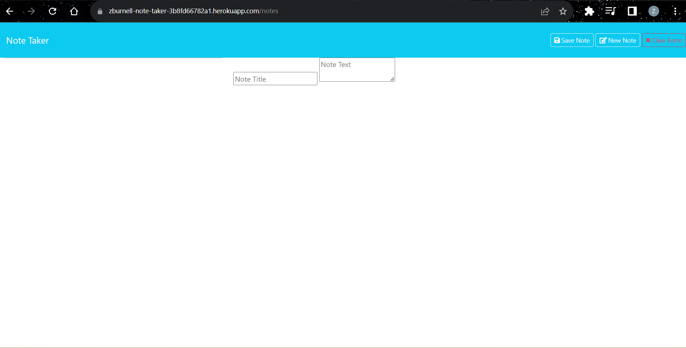

# note_taker
Challenge-11 Express.js

# Description
This project was tough and needs some work to be fully polished and working. Having the front end code completed allowed me to focus solely on the back end and tying the two together. That came with it's on set of challenges. Mainly interrupting someone elses code and getting it to work with my own. All in all it was a good experience and will help me in the future when I am working on a team with other developers.

# Table of Content

1. [Description](#description)
2. [Demonstration](#demonstration)
3. [Deployment](#deployment)
4. [Usage](#usage)
5. [Credits](#credits)
6. [License](#license)
7. [Features](#features)

# Deployment
Link to the deployed application -> [Heroku Deployment](https://zburnell-note-taker-3b8fd66782a1.herokuapp.com)

   
# Usage
from the command line clone this repo. From there you can run an "NPM I" to install the needed packages. Once that is done you can run "NPM start" which will allow the app to run locally. For a more seamless user experiance I would recommend using the link to the deployed application.

* Required before initialization
* [Node.JS](https://nodejs.org/en)
* [UUID Package](https://www.npmjs.com/package/uuid)

# Credits
Source code was taken from the "OSU-VIRT-FSF-PT-08-2023-U-LOLC" repository. Lessons from module 10-OPP and 11-Express from the previously mentioned repository were used as a reference point for where to begin. 
Stack Overflow and nodejs.org were used as a reference and to come up with the proper syntax for this project

# License

* [MIT License link](https://github.com/git/git-scm.com/blob/main/MIT-LICENSE.txt)
  
Copyright (c) 2012-2023 Scott Chacon and others

Permission is hereby granted, free of charge, to any person obtaining
a copy of this software and associated documentation files (the
"Software"), to deal in the Software without restriction, including
without limitation the rights to use, copy, modify, merge, publish,
distribute, sublicense, and/or sell copies of the Software, and to
permit persons to whom the Software is furnished to do so, subject to
the following conditions:

The above copyright notice and this permission notice shall be
included in all copies or substantial portions of the Software.

THE SOFTWARE IS PROVIDED "AS IS", WITHOUT WARRANTY OF ANY KIND,
EXPRESS OR IMPLIED, INCLUDING BUT NOT LIMITED TO THE WARRANTIES OF
MERCHANTABILITY, FITNESS FOR A PARTICULAR PURPOSE AND
NONINFRINGEMENT. IN NO EVENT SHALL THE AUTHORS OR COPYRIGHT HOLDERS BE
LIABLE FOR ANY CLAIM, DAMAGES OR OTHER LIABILITY, WHETHER IN AN ACTION
OF CONTRACT, TORT OR OTHERWISE, ARISING FROM, OUT OF OR IN CONNECTION
WITH THE SOFTWARE OR THE USE OR OTHER DEALINGS IN THE SOFTWARE.
    
   
# Features
This project is to help make note taking effcient while making task needed to get done easier to keep track of.
